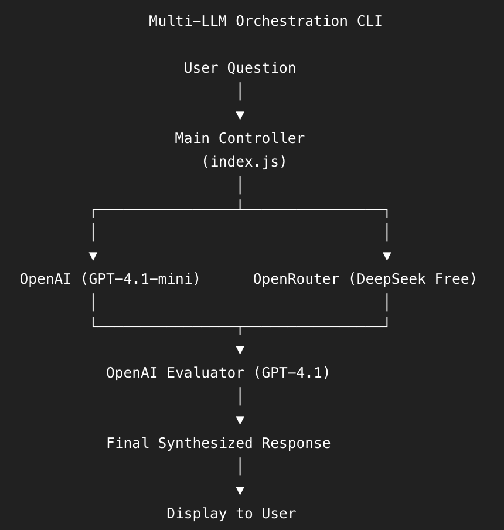
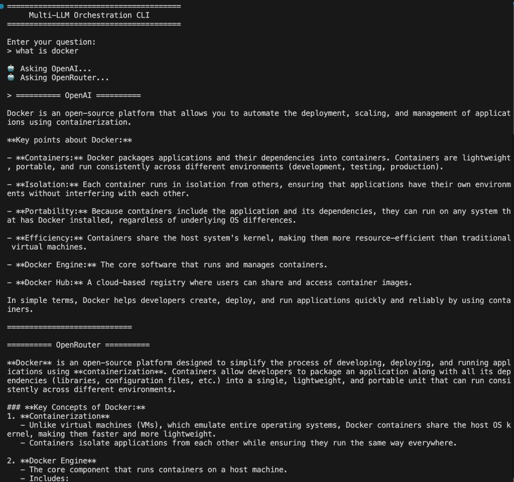
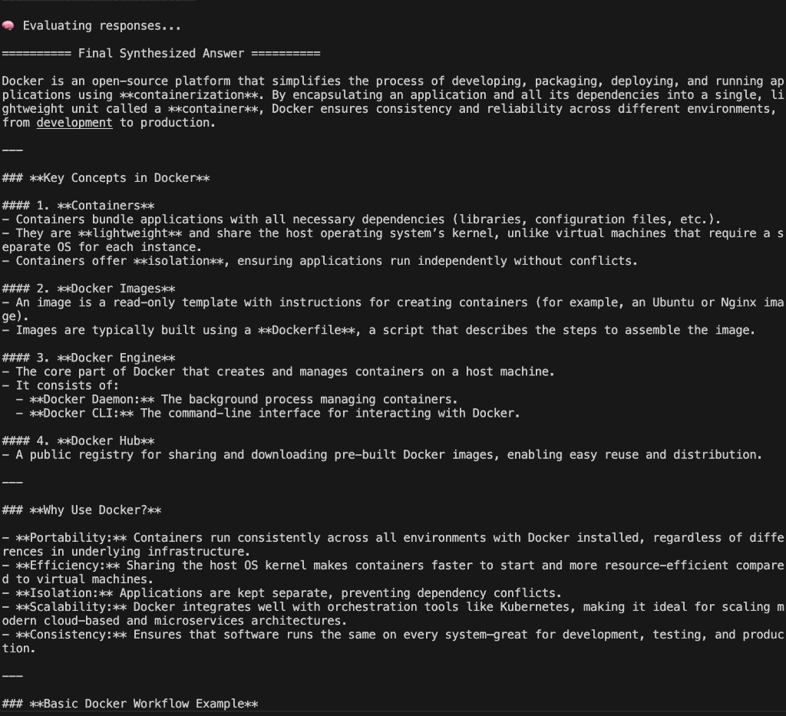

# Multi-LLM Orchestration

This project is a CLI application that orchestrates multiple Large Language Models (LLMs) to synthesize the best possible response using a self-consistency and evaluation flow.

## How the Project Works

The application prompts the user for a question and then queries multiple LLM providers in parallel. Once the initial responses are received, they are passed to a final evaluator model. The evaluator analyzes the initial responses, compares their strengths and weaknesses, and synthesizes a single, comprehensive final answer that combines the best parts of both. 

## Architecture Flow



## CLI-Based Interface

This project is **CLI-based**. It runs entirely in the terminal using Node.js. It leverages the built-in `readline` module to accept user input and prints the intermediate responses and the final synthesized answer directly to the console.

## Models and Providers Used

The project uses the following providers and models:

1. **OpenAI**: Uses the `gpt-4.1-mini` model to generate the first initial response.
2. **OpenRouter**: Uses the `deepseek/deepseek-chat-v3-0324` model to generate the second initial response.
3. **OpenAI Evaluator**: Uses the `gpt-4.1` model as the expert evaluator to synthesize the final answer.

## Self-Consistency Flow Implementation

The self-consistency and evaluation flow is implemented as follows:

1. **Parallel Execution**: The user's question is sent to both OpenAI and OpenRouter simultaneously using `Promise.allSettled`. This ensures both requests run in parallel, reducing overall latency.
2. **Error Handling**: If a request to one of the models fails, it gracefully handles the error, providing a fallback message indicating the failure.
3. **Evaluation Prompting**: The responses from both models (or their failure messages) are passed to an evaluator function (`evaluateResponses`). 
4. **Synthesis**: The evaluator function sends a specialized prompt to `gpt-4.1`. This prompt instructs the model to act as an expert evaluator, compare the two initial responses, identify their strengths and weaknesses, and output ONE new, organized response that combines the best parts of both without simply copying them.

## How to Run the Project

Follow these steps to set up and run the CLI application locally:

### 1. Clone the Repository
```bash
git clone https://github.com/Amitkhandelwal001/Multi-LLM-Orchestration.git
cd Multi-LLM-Orchestration
```

### 2. Install Dependencies
```bash
npm install
```

### 3. Configure Environment Variables
Create a `.env` file in the root of your project and add your API keys:
```env
OPENAI_API_KEY=your_openai_api_key_here
OPENROUTER_API_KEY=your_openrouter_api_key_here
```

### 4. Run the Application
You can start the CLI using:
```bash
npm start
```
Or, if you are developing and want it to restart automatically on changes:
```bash
npm run dev
```

## Screenshots

### Initial Responses (OpenAI & OpenRouter)


### Final Synthesized Answer (Evaluator)


